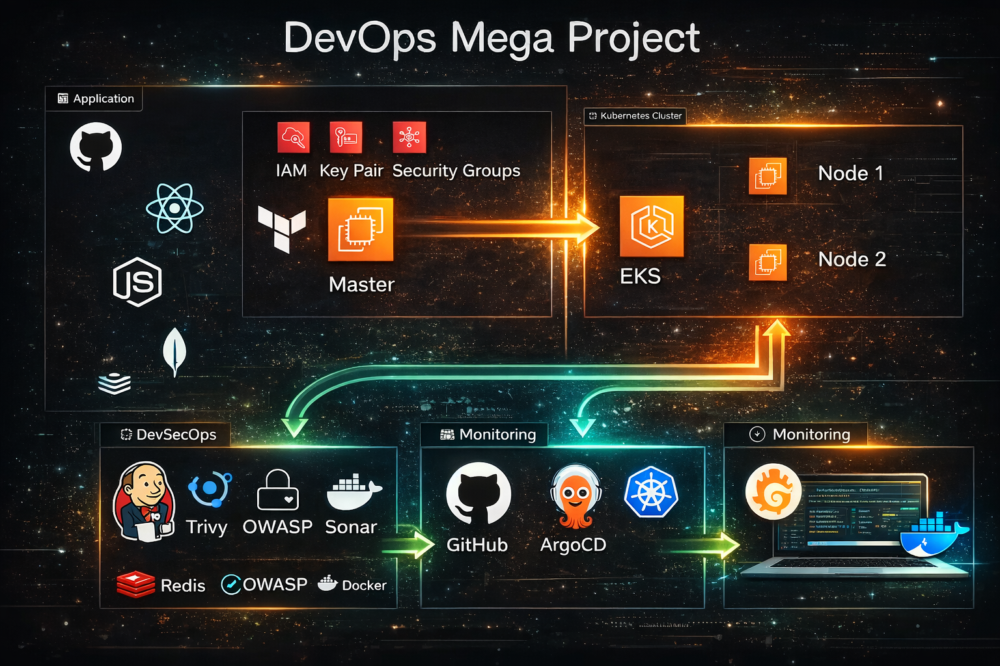
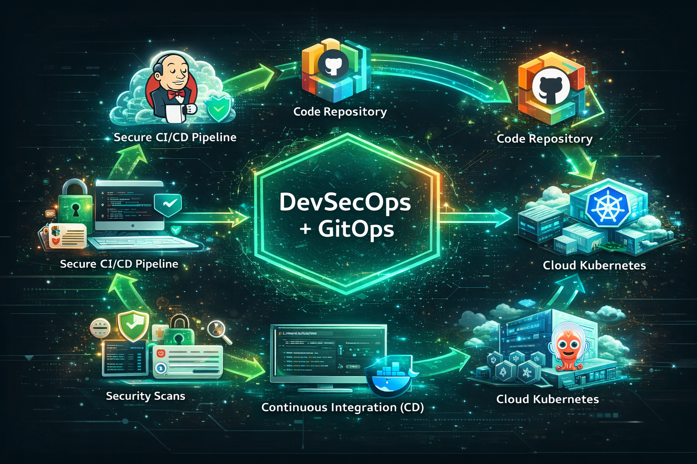

# Wanderlust — DevSecOps, GitOps & Cloud-Native Delivery on AWS

> **Project:** This project was designed, implemented, tested, documented, and evolved by me. It is the project I use to demonstrate practical work across AWS, Jenkins, Docker, Kubernetes, EKS, Argo CD, Terraform, security, observability, and production-oriented deployment practices.

Wanderlust is a full-stack application delivered through a complete DevSecOps + GitOps workflow:

```text
GitHub
  ↓
Jenkins CI
  ├── Trivy filesystem scan
  ├── OWASP Dependency-Check
  ├── SonarQube analysis + Quality Gate
  ├── Docker build
  ├── Trivy container scan
  └── Docker Hub push
          ↓
GitOps Jenkins
  ↓
Kubernetes image-tag update
  ↓
GitHub desired state
  ↓
Argo CD
  ↓
Amazon EKS
  ↓
Wanderlust workloads
  ↓
Prometheus + Grafana
  ↓
CloudWatch / Container Insights

Optional AWS edge layer:
CloudFront → WAF → EKS Frontend Load Balancer
```

The public repository is intentionally cleaned of runtime secrets, private credentials, machine-specific paths, and environment-specific infrastructure values.

---

## 1. What I built

### Application

- React + TypeScript + Vite frontend
- Node.js + Express backend
- MongoDB application database
- Redis cache
- Dockerized application components

### DevOps / DevSecOps

- GitHub source control
- Jenkins CI pipeline
- Jenkins GitOps deployment pipeline
- Jenkins Shared Library integration
- SonarQube static analysis
- SonarQube Quality Gate
- OWASP Dependency-Check
- Trivy filesystem and container image scanning
- Docker image hardening
- Docker Hub image publishing

### Cloud / Infrastructure

- Amazon EKS
- AWS EC2 support host
- AWS IAM
- AWS Systems Manager (SSM)
- AWS CloudWatch
- AWS WAF
- Amazon CloudFront
- AWS Load Balancer integration through Kubernetes `LoadBalancer` services
- Terraform Infrastructure as Code

### Kubernetes / GitOps

- Kubernetes namespace isolation
- Deployments and Services
- PersistentVolume / PersistentVolumeClaim
- MongoDB and Redis workloads
- RollingUpdate strategy
- readiness/liveness probes
- resource requests/limits
- non-root containers
- Linux capability dropping
- seccomp RuntimeDefault
- Kubernetes Secrets workflow
- rollback tooling
- Argo CD automated sync, pruning, and self-healing

### Observability

- Prometheus
- Grafana
- Prometheus Node Exporter
- kube-state-metrics
- Alertmanager
- Amazon CloudWatch Observability EKS add-on documentation
- CloudWatch application log group and EC2 CPU alarm through Terraform

---

# 2. Architecture

## End-to-end architecture

```text
                         ┌──────────────────────┐
                         │      Developer       │
                         └──────────┬───────────┘
                                    │ git push
                                    ▼
                         ┌──────────────────────┐
                         │       GitHub         │
                         └──────────┬───────────┘
                                    │
                                    ▼
                         ┌──────────────────────┐
                         │      Jenkins CI      │
                         ├──────────────────────┤
                         │ Trivy FS / Secrets   │
                         │ OWASP Dependency     │
                         │ SonarQube            │
                         │ Quality Gate         │
                         │ Docker Build         │
                         │ Trivy Image Scan     │
                         │ Docker Hub Push      │
                         └──────────┬───────────┘
                                    │ image tags
                                    ▼
                         ┌──────────────────────┐
                         │   GitOps Jenkins     │
                         ├──────────────────────┤
                         │ Update k8s image     │
                         │ Commit + push        │
                         └──────────┬───────────┘
                                    │
                                    ▼
                         ┌──────────────────────┐
                         │       GitHub         │
                         │ Desired K8s State    │
                         └──────────┬───────────┘
                                    │
                                    ▼
                         ┌──────────────────────┐
                         │       Argo CD        │
                         │ Sync / Self-Heal     │
                         └──────────┬───────────┘
                                    │
                                    ▼
                    ┌────────────────────────────────┐
                    │          Amazon EKS             │
                    │                                │
                    │  ┌─────────┐   ┌───────────┐  │
                    │  │Frontend │   │  Backend  │  │
                    │  └────┬────┘   └─────┬─────┘  │
                    │       │              │        │
                    │       │         ┌────┴────┐   │
                    │       │         │ MongoDB │   │
                    │       │         └─────────┘   │
                    │       │         ┌─────────┐   │
                    │       └────────►│  Redis  │   │
                    │                 └─────────┘   │
                    └────────────────────────────────┘
                                    │
                    ┌───────────────┴────────────────┐
                    │                                │
                    ▼                                ▼
             Prometheus / Grafana             CloudWatch
             metrics / dashboards             logs / insights

Optional public edge:

User → CloudFront → AWS WAF → EKS Frontend Load Balancer → Frontend Pods
```

## Architecture image



## DevSecOps + GitOps flow



---

# 3. Repository structure

```text
.
├── Assets/                         # Architecture diagrams and deployment screenshots
├── Automations/                    # Runtime configuration helper scripts
├── GitOps/
│   └── Jenkinsfile                 # GitOps image promotion pipeline
├── argocd/
│   └── application.yaml             # Argo CD Application definition
├── aws/
│   └── cloudfront/
│       └── README.md                # CloudFront + WAF design and setup
├── backend/                         # Node.js / Express API
│   ├── controllers/
│   ├── models/
│   ├── routes/
│   ├── services/
│   ├── tests/
│   ├── .env.example
│   └── Dockerfile
├── frontend/                        # React / TypeScript / Vite app
│   ├── src/
│   ├── .env.example
│   └── Dockerfile
├── kubernetes/
│   ├── namespace.yaml
│   ├── backend.yaml
│   ├── frontend.yaml
│   ├── mongodb.yaml
│   ├── redis.yaml
│   ├── persistentVolume.yaml
│   ├── persistentVolumeClaim.yaml
│   ├── secrets/
│   │   ├── backend-env.example.yaml
│   │   └── README.md
│   └── README.md
├── monitoring/
│   └── cloudwatch/
│       └── README.md                # CloudWatch EKS observability
├── scripts/
│   └── rollback.sh                  # Kubernetes deployment rollback helper
├── security/
│   ├── container-hardening.md       # Container security design
│   └── trivy/
│       └── scan.sh                  # Reusable Trivy scanner
├── terraform/
│   ├── ec2.tf                       # EC2 support host
│   ├── iam.tf                       # IAM + SSM role
│   ├── cloudwatch.tf                # Logs + EC2 alarm
│   ├── cloudfront.tf                # Optional CloudFront
│   ├── waf.tf                       # Optional CloudFront WAF
│   ├── outputs.tf
│   ├── terraform.tf
│   ├── terraform.tfvars.example
│   ├── variables.tf
│   └── README.md
├── Jenkinsfile                      # CI pipeline
├── docker-compose.yml               # Local development stack
├── .gitignore                       # Secrets and local artifacts
└── README.md
```

---

# 4. Technology stack

| Area | Technology |
|---|---|
| Source control | GitHub |
| CI | Jenkins |
| CI shared library | Jenkins Shared Library |
| Code quality | SonarQube |
| Dependency security | OWASP Dependency-Check |
| SAST / vulnerability scanning | Trivy |
| Container runtime | Docker |
| Image registry | Docker Hub |
| Container orchestration | Kubernetes |
| Cloud Kubernetes | Amazon EKS |
| GitOps | Argo CD |
| Infrastructure as Code | Terraform |
| Cloud compute | Amazon EC2 |
| Cloud IAM | AWS IAM |
| Secure host administration | AWS Systems Manager |
| Edge delivery | Amazon CloudFront |
| Web application firewall | AWS WAF |
| Cloud observability | Amazon CloudWatch |
| Metrics | Prometheus |
| Dashboards | Grafana |
| Alerting | Alertmanager |
| Database | MongoDB |
| Cache | Redis |
| Backend | Node.js / Express |
| Frontend | React / TypeScript / Vite |
| Web server | Nginx unprivileged |

---

# 5. CI pipeline — Jenkins

The root `Jenkinsfile` performs the CI portion of the workflow.

## Stages in order

### Step 1 — Validate parameters

The pipeline requires:

```text
FRONTEND_DOCKER_TAG
BACKEND_DOCKER_TAG
VITE_API_PATH
```

### Step 2 — Workspace cleanup

Jenkins starts with a clean workspace.

### Step 3 — Git checkout

```text
https://github.com/Amar-Karale/DevOps-Projects.git
```

### Step 4 — Trivy filesystem scan

Trivy scans the repository for:

- vulnerabilities
- insecure configuration
- secrets

The pipeline focuses on HIGH and CRITICAL findings and ignores unfixed vulnerabilities by default.

### Step 5 — OWASP Dependency-Check

Application dependencies are checked against known vulnerability data.

### Step 6 — SonarQube analysis

The code is analyzed for bugs, vulnerabilities, code smells, and maintainability issues.

### Step 7 — SonarQube Quality Gate

The configured quality gate controls whether CI can continue.

### Step 8 — Frontend build configuration

The public API endpoint is injected into the generated frontend environment file during CI instead of being committed as a secret.

### Step 9 — Docker image build

The backend and frontend images are built using multi-stage Dockerfiles.

### Step 10 — Trivy container image scan

Both newly built images are scanned before publication.

For a soft reporting gate, the repository uses:

```groovy
TRIVY_EXIT_CODE = '0'
```

For a strict production gate, set it to:

```groovy
TRIVY_EXIT_CODE = '1'
```

### Step 11 — Docker Hub push

Jenkins credentials are used for authentication. Passwords/tokens are not stored in source code.

Images:

```text
amarkarale/wanderlust-backend-beta:<tag>
amarkarale/wanderlust-frontend-beta:<tag>
```

### Step 12 — GitOps handoff

A successful CI build passes the image tags to the GitOps deployment job.

---

# 6. Container hardening

Container hardening is part of the implementation, not only documentation.

## Backend

The runtime stage:

- uses a slim Alpine base
- installs only production dependencies
- removes the npm cache
- copies files with correct ownership
- runs as the non-root `node` user

## Frontend

The final image:

- contains only compiled frontend assets
- uses `nginxinc/nginx-unprivileged`
- does not run Nginx as root
- exposes port `8080` internally

## Kubernetes runtime hardening

The application deployments use:

```yaml
runAsNonRoot: true
allowPrivilegeEscalation: false
capabilities:
  drop:
    - ALL
seccompProfile:
  type: RuntimeDefault
```

They also define:

- CPU requests and limits
- memory requests and limits
- readiness probes
- liveness probes
- two replicas for frontend/backend
- rolling update strategy
- deployment revision history

More details are in [`security/container-hardening.md`](security/container-hardening.md).

---

# 7. Trivy implementation

Trivy is included at both source and image levels.

## Jenkins

```text
Source checkout
   ↓
Trivy filesystem scan
   ↓
OWASP
   ↓
SonarQube
   ↓
Docker build
   ↓
Trivy image scan
   ↓
Docker Hub
```

## Manual scan

```bash
chmod +x security/trivy/scan.sh
./security/trivy/scan.sh \
  amarkarale/wanderlust-backend-beta:v5 \
  amarkarale/wanderlust-frontend-beta:v5
```

The manual scanner checks vulnerabilities, misconfiguration, and secrets.

---

# 8. Kubernetes Secrets

Real secrets are not stored in Git.

A safe template is provided at:

```text
kubernetes/secrets/backend-env.example.yaml
```

Create the live secret outside Git:

```bash
cp kubernetes/secrets/backend-env.example.yaml kubernetes/secrets/backend-env.yaml
```

Replace the placeholders, then:

```bash
kubectl apply -f kubernetes/secrets/backend-env.yaml
```

Verify without printing secret values:

```bash
kubectl -n wanderlust get secret backend-env
```

The backend consumes it through:

```yaml
envFrom:
  - secretRef:
      name: backend-env
```

### Production recommendation

For a production AWS implementation, move the secret source to:

```text
AWS Secrets Manager
      ↓
External Secrets Operator
      ↓
Kubernetes Secret
      ↓
Backend Pods
```

---

# 9. Kubernetes deployment

All application resources use the `wanderlust` namespace.

### Core resources

```text
namespace.yaml
persistentVolume.yaml
persistentVolumeClaim.yaml
mongodb.yaml
redis.yaml
backend.yaml
frontend.yaml
```

## Backend

- 2 replicas
- rolling update
- NodePort service on `31100`
- container port `8080`
- readiness/liveness probes
- resources and security context

## Frontend

- 2 replicas
- rolling update
- AWS `LoadBalancer` service
- service port `80`
- container port `8080`
- production Nginx runtime

The LoadBalancer frontend is deliberate: it creates a stable AWS origin for the optional CloudFront layer.

Detailed Kubernetes instructions are in [`kubernetes/README.md`](kubernetes/README.md).

---

# 10. Rollback strategy

Rollback is documented and scripted.

## Kubernetes emergency rollback

View rollout history:

```bash
kubectl -n wanderlust rollout history deployment/backend-deployment
```

Rollback to the previous revision:

```bash
./scripts/rollback.sh wanderlust backend-deployment
```

Rollback to a specific revision:

```bash
./scripts/rollback.sh wanderlust backend-deployment 3
```

Check status:

```bash
kubectl -n wanderlust rollout status deployment/backend-deployment
```

The same approach can be used for:

```text
frontend-deployment
redis-deployment
mongo-deployment
```

## GitOps rollback

For a GitOps-controlled environment, the preferred long-term rollback is to revert the Git commit containing the bad Kubernetes image tag. Argo CD then restores the cluster to the reverted desired state.

This keeps Git as the source of truth.

---

# 11. Argo CD

The Argo CD Application definition is:

```text
argocd/application.yaml
```

It points to:

```text
Repository: https://github.com/Amar-Karale/DevOps-Projects.git
Branch: master
Path: kubernetes
Namespace: wanderlust
```

Sync policy:

```text
Automated
Prune
Self-heal
CreateNamespace
```

Conceptually:

```text
GitHub
  │
  └── Kubernetes desired state
          │
          ▼
       Argo CD
          │
          ▼
        Amazon EKS
```

---

# 12. Terraform — AWS infrastructure

Terraform is used for the AWS infrastructure/support layer.

The Terraform directory manages:

- EC2 support host
- encrypted gp3 storage
- IAM role
- Systems Manager access
- CloudWatch log group
- CloudWatch CPU alarm
- optional CloudFront distribution
- optional AWS WAF protection

See [`terraform/README.md`](terraform/README.md).

## Terraform workflow

```bash
cd terraform
cp terraform.tfvars.example terraform.tfvars
terraform init
terraform fmt
terraform validate
terraform plan
terraform apply
```

Never commit:

```text
terraform.tfvars
*.tfstate
.terraform/
```

The public repository contains only the safe variable template.

---

# 13. AWS Systems Manager

The Terraform IAM role grants:

```text
AmazonSSMManagedInstanceCore
```

to the EC2 support host.

The goal is to use AWS Systems Manager Session Manager for administrative access instead of depending on public SSH access for routine operations.

SSH remains parameterized through `ssh_cidr_blocks` so it can be restricted to a trusted IP range or removed once SSM access is confirmed.

---

# 14. CloudWatch observability

Prometheus and Grafana remain the Kubernetes-focused metrics/dashboard stack.

CloudWatch adds AWS-native operational visibility.

```text
EKS workloads
     │
     ├── Prometheus → Grafana
     │
     └── CloudWatch Observability EKS add-on
              │
              ├── CloudWatch Logs
              ├── Container Insights
              └── Application Signals / OTel
```

This repository includes:

- `terraform/cloudwatch.tf` for log group + EC2 alarm
- `monitoring/cloudwatch/README.md` for the EKS CloudWatch Observability add-on

The CloudWatch guide uses the current AWS-recommended observability add-on approach.

---

# 15. CloudFront + AWS WAF

CloudFront is the optional edge-delivery layer for the frontend.

```text
Browser
  ↓ HTTPS
CloudFront
  ↓
AWS WAF
  ↓
Frontend AWS Load Balancer
  ↓
EKS frontend pods
```

## Benefits

- CDN caching
- global edge delivery
- HTTPS at the edge
- stable public frontend endpoint
- lower latency
- reduced load on EKS frontend pods

## WAF

The Terraform WAF configuration uses an AWS Managed Rules Common Rule Set as a baseline.

## Enable it

After the frontend LoadBalancer exists:

```bash
kubectl -n wanderlust get svc frontend-service
```

Copy the AWS Load Balancer DNS name into:

```hcl
enable_cloudfront             = true
cloudfront_origin_domain_name = "YOUR-FRONTEND-LB-DNS"
```

Then:

```bash
cd terraform
terraform plan
terraform apply
terraform output cloudfront_domain_name
```

For a custom domain, add DNS and an ACM certificate following the AWS CloudFront certificate requirements.

Full details: [`aws/cloudfront/README.md`](aws/cloudfront/README.md).

---

# 16. Monitoring stack

The Kubernetes monitoring stack used by the project contains:

- Prometheus
- Grafana
- Node Exporter
- kube-state-metrics
- Alertmanager

Example checks:

```bash
kubectl get pods -n prometheus
kubectl get svc -n prometheus
```

For Grafana/Prometheus browser access, use the AWS LoadBalancer endpoint created for the corresponding service in the target cluster.

---

# 17. Testing

Backend tests:

```bash
cd backend
npm ci
npm test
```

Frontend tests:

```bash
cd frontend
npm ci
npm test
npm run build
```

Security scans:

```bash
./security/trivy/scan.sh
```

---

# 18. Local development

The repository also contains `docker-compose.yml`.

Create local environment files from the safe examples:

```bash
cp backend/.env.example backend/.env.docker
cp frontend/.env.example frontend/.env.docker
```

Set your own values and run:

```bash
docker compose up --build
```

Stop the stack:

```bash
docker compose down
```

---

# 19. Complete rebuild order

This is the recommended order for another engineer rebuilding the project from this repository.

### Phase A — AWS prerequisites

1. Create/select an AWS account and region.
2. Configure AWS CLI credentials or IAM Identity Center.
3. Create/verify an EKS cluster and worker nodes.
4. Configure `kubectl` for the cluster.
5. Install Argo CD.
6. Ensure EKS has the AWS Load Balancer functionality required by the frontend `LoadBalancer` service.

### Phase B — Terraform support layer

7. Enter `terraform/`.
8. Copy `terraform.tfvars.example` to `terraform.tfvars`.
9. Add your own AMI, key, public key, region, and trusted SSH CIDR.
10. Run `terraform init`.
11. Run `terraform fmt`.
12. Run `terraform validate`.
13. Run `terraform plan`.
14. Apply Terraform when the plan is correct.
15. Verify the EC2 SSM role and CloudWatch resources.

### Phase C — Kubernetes application foundation

16. Create the `wanderlust` namespace.
17. Create the live `backend-env` Kubernetes Secret from the example template.
18. Apply persistent storage resources.
19. Apply MongoDB.
20. Apply Redis.

### Phase D — CI configuration

21. Install/configure Jenkins.
22. Configure the Jenkins Shared Library.
23. Configure SonarQube.
24. Configure OWASP Dependency-Check.
25. Install/configure Trivy on the Jenkins agent.
26. Add Docker Hub credentials to Jenkins.
27. Add GitHub credentials required by the GitOps job.
28. Run the CI pipeline with frontend/backend image tags and the correct API URL.

### Phase E — Image delivery

29. Jenkins runs Trivy filesystem scanning.
30. Jenkins runs OWASP Dependency-Check.
31. Jenkins runs SonarQube and the Quality Gate.
32. Jenkins builds the backend image.
33. Jenkins builds the frontend image.
34. Jenkins runs Trivy image scans.
35. Jenkins publishes both images to Docker Hub.

### Phase F — GitOps delivery

36. GitOps Jenkins receives the image tags.
37. It updates `kubernetes/backend.yaml` and `kubernetes/frontend.yaml`.
38. It commits the desired state.
39. It pushes the change to GitHub.
40. Argo CD detects the Git change.
41. Argo CD synchronizes EKS.
42. Verify the rollout and pod health.

### Phase G — CloudFront + WAF

43. Verify the frontend `LoadBalancer` hostname.
44. Enable the CloudFront Terraform configuration.
45. Apply Terraform.
46. Verify the CloudFront distribution.
47. Configure the backend `FRONTEND_URL` for the new public frontend URL.
48. Add a custom domain + ACM certificate when required.

### Phase H — Observability

49. Install Prometheus/Grafana.
50. Verify Prometheus targets.
51. Verify Grafana dashboards.
52. Install the Amazon CloudWatch Observability EKS add-on.
53. Verify CloudWatch agent pods.
54. Verify CloudWatch Logs / Container Insights.
55. Configure alerting for node, pod, and application failures.

### Phase I — Rollback verification

56. Deploy a known-good image.
57. Promote a deliberately bad test image in a non-production environment.
58. Observe rollout status.
59. Use `kubectl rollout history`.
60. Roll back to the previous revision.
61. For GitOps, revert the bad Git commit and allow Argo CD to reconcile.

---

# 20. Operational checklist

Before declaring a deployment healthy:

```bash
kubectl get nodes
kubectl get pods -n wanderlust
kubectl get svc -n wanderlust
kubectl get pvc -n wanderlust
argocd app get wanderlust
```

Application checks:

```bash
kubectl -n wanderlust get deployment backend-deployment
kubectl -n wanderlust get deployment frontend-deployment
kubectl -n wanderlust rollout status deployment/backend-deployment
kubectl -n wanderlust rollout status deployment/frontend-deployment
```

Monitoring checks:

```bash
kubectl get pods -n prometheus
kubectl get svc -n prometheus
kubectl get pods -n amazon-cloudwatch
```

---

# 21. Security principles used in the project

The repository follows these principles:

- no production secrets in Git
- least-privilege credentials where practical
- container processes do not run as root
- Linux capabilities are dropped
- privilege escalation is disabled
- seccomp is enabled
- image vulnerabilities are scanned
- dependency vulnerabilities are scanned
- static code quality/security analysis is performed
- Kubernetes revision history is retained for rollback
- CloudFront can be protected by AWS WAF
- AWS host administration can use Systems Manager instead of SSH
- Terraform state is excluded from Git

---

# 22. What is intentionally not committed

The following are environment-specific and must be supplied by each deployment:

```text
AWS credentials
AWS account identifiers
private SSH keys
Docker Hub passwords/tokens
GitHub credentials
SonarQube credentials
JWT secrets
MongoDB credentials
Redis credentials
Kubernetes Secret values
Terraform tfvars
Terraform state
cluster-specific load balancer URLs
CloudFront custom DNS names
ACM certificate identifiers
```

This makes the project reusable while keeping sensitive deployment data outside the public repository.

---

# 23. Project screenshots and visual documentation

The repository contains architecture and deployment screenshots under `Assets/` and `kubernetes/assets/`.

### Architecture


### DevSecOps + GitOps flow


### Kubernetes implementation

The Kubernetes assets include screenshots for:

- EKS nodes
- namespaces
- MongoDB
- Redis
- persistent storage
- Docker builds
- Docker images
- backend/frontend workloads
- application output
- cluster configuration

These assets are retained as implementation evidence and learning documentation.

---

# 24. Project learning outcomes

This project gave me hands-on exposure to:

- designing CI/CD pipelines
- Jenkins pipeline troubleshooting
- Jenkins Shared Libraries
- Docker image creation and optimization
- Docker credential management
- Kubernetes workload design
- Amazon EKS operations
- GitOps with Argo CD
- automated manifest promotion
- Terraform Infrastructure as Code
- secrets management
- SonarQube quality gates
- dependency vulnerability scanning
- Trivy security scanning
- container hardening
- Prometheus/Grafana monitoring
- CloudWatch observability
- AWS IAM and Systems Manager
- AWS CloudFront and WAF concepts
- deployment verification and rollback
- troubleshooting failed builds, missing environment files, registry authentication, namespace issues, and Argo CD synchronization

The goal was not simply to make the application run, but to understand the complete lifecycle from source code to a monitored Kubernetes workload.

---

# 25. Final DevSecOps / GitOps lifecycle

```text
Developer
   ↓
GitHub
   ↓
Jenkins CI
   ↓
Trivy FS + Secrets
   ↓
OWASP Dependency-Check
   ↓
SonarQube + Quality Gate
   ↓
Docker Build
   ↓
Trivy Image Scan
   ↓
Docker Hub
   ↓
GitOps Jenkins
   ↓
Kubernetes Manifest Update
   ↓
GitHub Desired State
   ↓
Argo CD
   ↓
Amazon EKS
   ↓
RollingUpdate
   ↓
Prometheus / Grafana
   ↓
CloudWatch

Public frontend path:

Browser
  ↓ HTTPS
CloudFront
  ↓
AWS WAF
  ↓
EKS Frontend Load Balancer
  ↓
Frontend Pods

Failure path:

Bad Deployment
   ↓
Health / rollout failure
   ↓
Rollback
   ├── Kubernetes rollout undo
   └── Git revert → Argo CD reconciliation
```

---

# 26. Author

**Amar Karale**

Cloud / DevOps Engineering project developed and maintained as a portfolio implementation.

**Repository:** https://github.com/Amar-Karale/DevOps-Projects

---

# 27. License

MIT License — see [`LICENSE`](LICENSE).
