# Kubernetes Deployment Guide — Wanderlust

This directory contains the Kubernetes desired state for the Wanderlust application.

The manifests are intended to be consumed by **Argo CD** after the CI/GitOps pipeline promotes new Docker image tags.

> The screenshots in `kubernetes/assets/` document the implementation. Runtime credentials, cluster-specific values, and public endpoints are intentionally not committed to Git.

---

## 📦 Kubernetes resources

```text
namespace.yaml
persistentVolume.yaml
persistentVolumeClaim.yaml
mongodb.yaml
redis.yaml
backend.yaml
frontend.yaml
```

| Manifest | Purpose |
|---|---|
| `namespace.yaml` | Creates the `wanderlust` namespace |
| `persistentVolume.yaml` | Defines persistent storage for MongoDB |
| `persistentVolumeClaim.yaml` | Requests MongoDB storage |
| `mongodb.yaml` | MongoDB deployment and service |
| `redis.yaml` | Redis deployment and service |
| `backend.yaml` | Node.js API deployment and service |
| `frontend.yaml` | React frontend deployment and service |

---

## 🔗 Application service flow

```text
Frontend
   │
   └── backend-service:8080
             │
             ├── mongo-service:27017
             │
             └── redis-service:6379
```

All application resources belong to the `wanderlust` namespace.

---

## 🏷️ Container images

The CI pipeline publishes:

```text
amarkarale/wanderlust-backend-beta:<tag>
amarkarale/wanderlust-frontend-beta:<tag>
```

The GitOps pipeline updates `backend.yaml` and `frontend.yaml` with the exact tags produced by CI.

---

## 🚀 Argo CD

The repository contains the Argo CD Application definition at:

```text
../argocd/application.yaml
```

The application watches:

```text
Repository: https://github.com/Amar-Karale/DevOps-Projects.git
Branch: master
Path: kubernetes
Namespace: wanderlust
```

The configured sync policy enables automated synchronization, pruning, and self-healing.

For a new cluster, register the cluster with Argo CD and apply the Application definition from the repository.

---

## 🔐 Runtime configuration

Secrets are **not stored in Git**.

For a new deployment, create the backend runtime secret from your secure environment. Example structure:

```bash
kubectl create secret generic backend-env \
  -n wanderlust \
  --from-literal=MONGODB_URI='mongodb://mongo-service/wanderlust' \
  --from-literal=REDIS_URL='redis://redis-service:6379' \
  --from-literal=PORT='8080' \
  --from-literal=FRONTEND_URL='http://<frontend-host>:31000' \
  --from-literal=ACCESS_COOKIE_MAXAGE='120000' \
  --from-literal=ACCESS_TOKEN_EXPIRES_IN='120s' \
  --from-literal=REFRESH_COOKIE_MAXAGE='120000' \
  --from-literal=REFRESH_TOKEN_EXPIRES_IN='120s' \
  --from-literal=JWT_SECRET='<generate-a-new-random-secret>' \
  --from-literal=NODE_ENV='production'
```

Use your own secure values when rebuilding the project.

---

## 🧱 Persistent storage

MongoDB uses a PersistentVolume and PersistentVolumeClaim. Review the storage class and volume settings before deploying to a different EKS environment.

---

## 🧪 Verification

```bash
kubectl get pods -n wanderlust
kubectl get svc -n wanderlust
kubectl get deployments -n wanderlust
kubectl get pvc -n wanderlust
```

For logs and troubleshooting:

```bash
kubectl logs <pod-name> -n wanderlust
kubectl describe pod <pod-name> -n wanderlust
```

For Argo CD:

```bash
argocd app get wanderlust
argocd app sync wanderlust
```

---

## 📸 Deployment screenshots

### Cluster and namespace

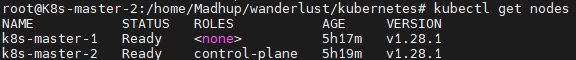


### DNS and cluster preparation

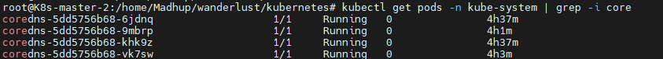

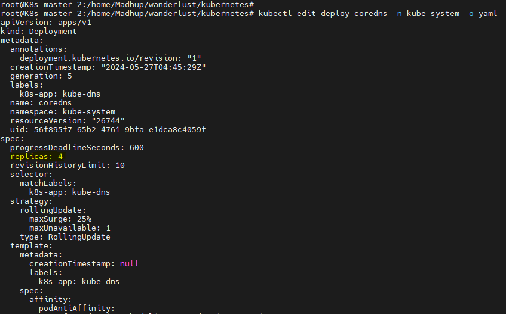

### Storage and data services

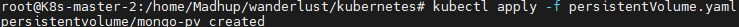

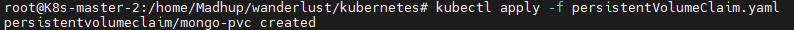

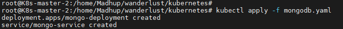

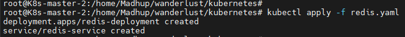

### Docker and environment preparation

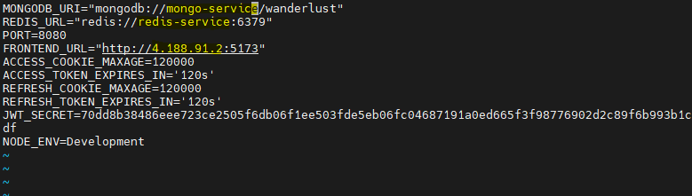

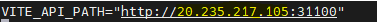


### Application workloads

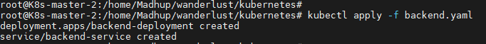

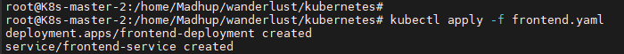

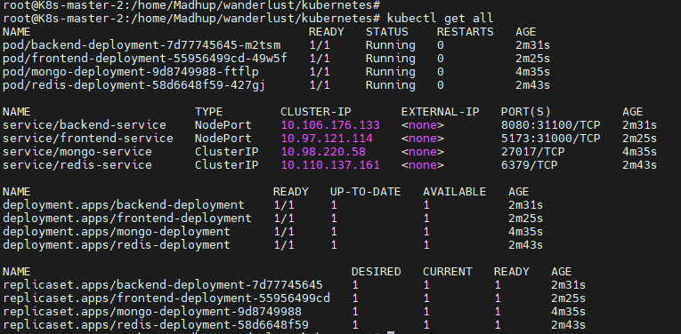

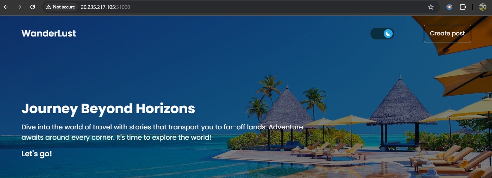

---

## 📝 Rebuild notes

This guide is written so another engineer can understand and recreate the deployment without access to the original infrastructure.

Replace all environment-specific values with your own AWS account, EKS cluster, Docker Hub images, DNS/load-balancer endpoints, and secrets.
